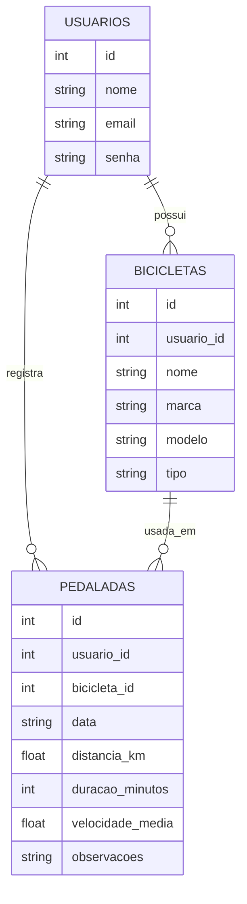

# 🗄️ Modelagem do Banco de Dados — BikeLog

## Entidades

O banco de dados inicial do BikeLog será composto por três entidades principais:

* Usuários
* Bicicletas
* Pedaladas

## Usuários

Tabela responsável por armazenar os usuários do sistema.

### Campos

| Campo      | Tipo     | Restrição        |
| ---------- | -------- | ---------------- |
| id         | INTEGER  | PK               |
| nome       | VARCHAR  | NOT NULL         |
| email      | VARCHAR  | UNIQUE, NOT NULL |
| senha      | VARCHAR  | NOT NULL         |
| created_at | DATETIME | NOT NULL         |

## Bicicletas

Tabela responsável pelas bicicletas cadastradas pelos usuários.

### Campos

| Campo      | Tipo     | Restrição |
| ---------- | -------- | --------- |
| id         | INTEGER  | PK        |
| usuario_id | INTEGER  | FK        |
| nome       | VARCHAR  | NOT NULL  |
| marca      | VARCHAR  | NULL      |
| modelo     | VARCHAR  | NULL      |
| tipo       | VARCHAR  | NULL      |
| created_at | DATETIME | NOT NULL  |

Relacionamento:

`bicicletas.usuario_id → usuarios.id`

Um usuário pode possuir várias bicicletas.

## Pedaladas

Tabela responsável pelo registro das atividades realizadas pelos usuários.

### Campos

| Campo            | Tipo     | Restrição |
| ---------------- | -------- | --------- |
| id               | INTEGER  | PK        |
| usuario_id       | INTEGER  | FK        |
| bicicleta_id     | INTEGER  | FK        |
| data             | DATE     | NOT NULL  |
| distancia_km     | DECIMAL  | NOT NULL  |
| duracao_minutos  | INTEGER  | NOT NULL  |
| velocidade_media | DECIMAL  | NOT NULL  |
| observacoes      | TEXT     | NULL      |
| created_at       | DATETIME | NOT NULL  |

Relacionamentos:

`pedaladas.usuario_id → usuarios.id`

`pedaladas.bicicleta_id → bicicletas.id`

## Relacionamentos

```text
USUÁRIO 1 ─────── N BICICLETA

USUÁRIO 1 ─────── N PEDALADA

BICICLETA 1 ───── N PEDALADA
```

## Observação

A estrutura poderá ser ajustada durante o desenvolvimento caso novos requisitos sejam identificados.

## DER — Diagrama Entidade-Relacionamento

